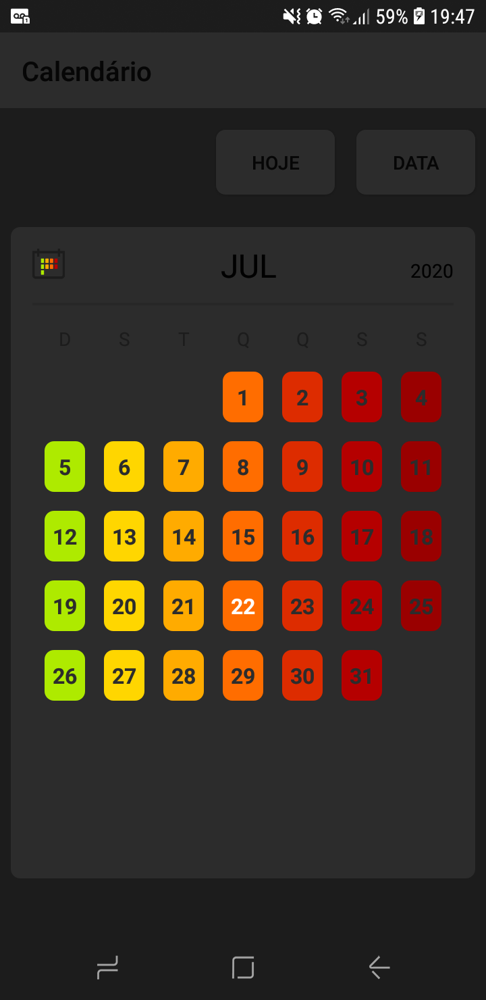

<h1>
Calendário

</h1>

  

**Calendário desenvolvido implementando a nova API de data e hora do java, presente a partir do java 8.**
 
 ---

## Sobre o projeto
A ideia do app nasceu no estudo sobre datas e horas no Java. Sempre escutei na comunidade sobre a não praticidade/dificuldade de implemetar datas e horas no java e estudando a fundo o assunto descobri que foi inserida uma nova API para tratar isso no java 8, criada em parceria com o criador da joda-time(uma biblioteca antes usada para tratar data e hora). 
### Baixe o app

### Funcionalidades
* para navegar entre os meses arraste para direita e esquerda
* para voltar para data atual aperte o botão HOJE
* para navegar até uma data específica aperte o botão DATA e insira mês e ano

### Observações
A amplitude tempotal do calendário é de do ano 2000 até 2040.

### Licença
MIT License - 
Veja o arquivo [LICENSE](LICENSE) para mais detalhes.
